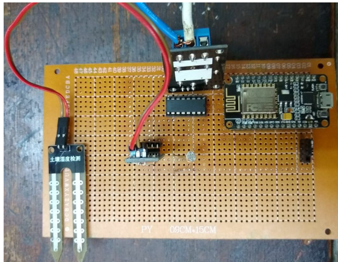
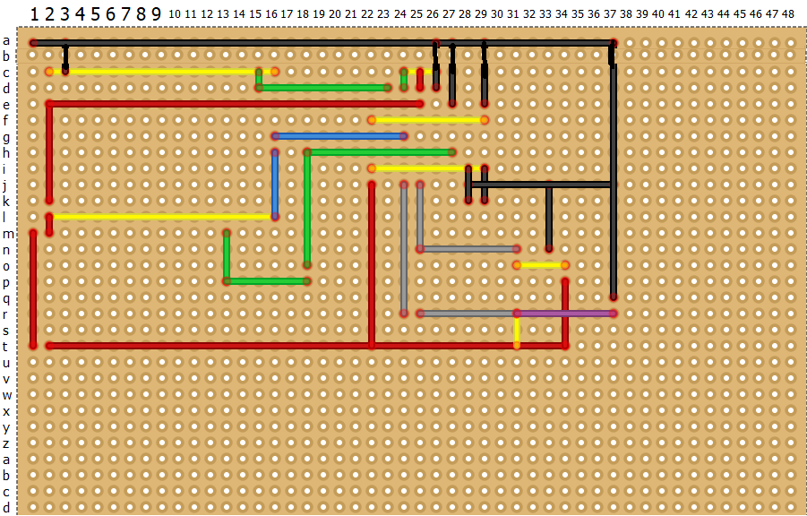
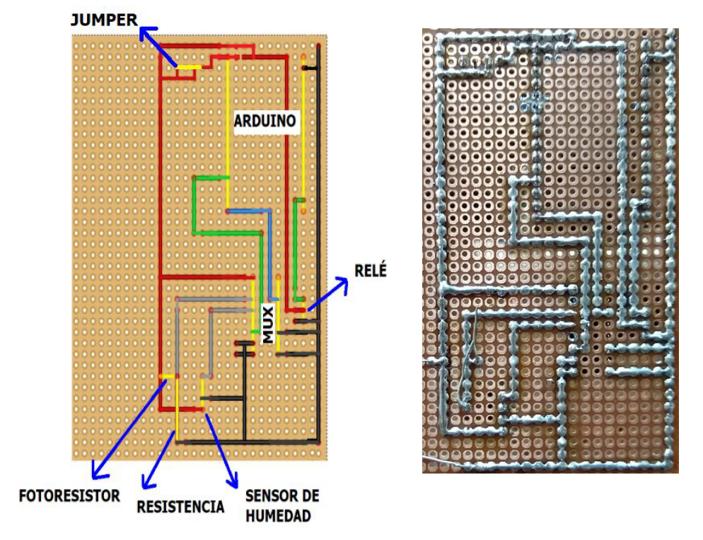
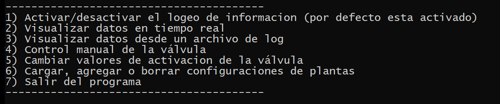

# Description
The idea was to build a simple and affordable device to water a plant, using sensors to check humidity and light exposure. In addition to the well-known hardware implementation for this purpose, a software control panel was developed in order to inspect the status measured by the sensors, as well as to set the values which are considered acceptable in terms of light and humidity levels. 

# Components
- Arduino ESP8266 (Lolin Nodemcu v3)
- GL5537 photoresistor
- HL-69 humidity sensor
- XJD-33 electrovalve
- SRV-05 relay
- 4051 multiplexor (CD4051BD) (used to take advantage of the only analogic pin available on the board) 

# Circuit

Considering the board's pinout:

the joins are sketched as follows:

# Preview
Software control panel:

Live visualization of light and humidity levels:

Reducing the light exposure, the electrovalve is activated, letting the water flow.

# How do I run it?
The control panel can be ran with Python 3, once the device is connected by USB. The following python modules should be installed: pyserial, numpy and tabulate.
